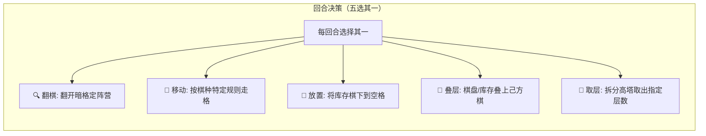

<div align="center">

<!-- [占位] 顶部主视觉横幅：建议 1200x420 新中式水墨木质棋风，详见 assets/README.md -->
<!--  -->

# ⚔️ 叠叠翻棋 (DieDieFlip)

<p align="center">
  <b>打破等级森严的双人变体翻棋独立博弈 • 纯前端零依赖原创棋类游戏</b><br>
  4×8 半盘 32 暗子。告别“将吃士、士吃象”的大小定势，引入空间堆叠与层数制敌机制。
</p>

<p align="center">
  
  
  
  
  
</p>

<p align="center">
  <a href="#-玩法革命"><b>🎲 玩法革命</b></a> •
  <a href="#-五大回合操作"><b>🖐️ 五大操作</b></a> •
  <a href="#-走子与特例"><b>♟️ 棋子走法</b></a> •
  <a href="#-架构与测试"><b>🛡️ 硬核工程</b></a> •
  <a href="#-本地运行"><b>🚀 本地试玩</b></a> •
  <a href="#-版本沿革"><b>📜 版本记录</b></a>
</p>

</div>

---

## 🎲 玩法革命：传统暗棋 vs 叠叠翻棋

<!-- [占位] 对弈演示动图：详见 assets/README.md -->
<!-- <div align="center"></div> -->

| 维度 | 传统中国象棋暗棋 (翻翻棋) | 叠叠翻棋 (DieDieFlip) | 带来的博弈乐趣 |
| :--- | :--- | :--- | :--- |
| **胜负吃子定势** | 等级森严（帅>仕>相>车...），抽到小卒全盘劣势 | **层数决胜**：层数多者吃少者，同层互吃，无关棋种尊卑 | **绝境逆转**：小卒叠高亦能生擒敌帅 |
| **棋子生存空间** | 二维平面死板走子，被逼入死角即亡 | **空间堆叠**：支持同阵营棋子原地叠层、高塔防御与战术取层 | **多维纵深**：棋盘从平面转为微型三维塔防 |
| **击杀战利品** | 吃掉的棋子直接出局，盘面子力不断衰减 | **整叠入库存**：击破敌方叠层后，整叠棋子收归己方私库再投放 | **以战养战**：越攻越强，局势瞬息万变 |
| **博弈与容错** | 运气成分过高，单招失误直接崩盘 | 严格交替行动，内置历史状态快照，支持无损悔棋与和局协议 | **纯粹策略**：运气与深度规划的黄金平衡 |

---

## 🖐️ 五大回合核心操作 (Core Actions)

双方轮流行动，每回合必须且只能在以下 5 种行动中任选其一：


```

<details open>
<summary><b>展开查看五大操作规则细节</b></summary>

1. **🔍 翻棋 (Flip)**：点击任意未翻开的暗格棋子翻至正面。第一枚翻出的棋子颜色决定先行方所属阵营。
2. **🏃 移动 (Move & Capture)**：选中棋盘上已翻开的己方棋子（或叠层），按走法规则移动至空格或执行吃子。
   - **吃子判定**：无视兵种，仅看层数！**层数多吃层数少，同层可互吃**。吃掉敌方叠层时，该叠所有棋子整叠进入己方可用库存。
3. **🎯 放置 (Deploy)**：从已获得的己方库存中取出一枚棋子，投放到棋盘任意空位。
4. **🗼 叠层 (Stack)**：
   - **盘面叠层**：移动己方棋子叠在另一枚己方棋子上，合并为高层塔。
   - **库存叠层**：从库存取棋直接叠在盘面己方棋子上方。
5. **🤏 取层 (Unstack)**：选中己方多层叠层，利用取层控制条取出指定数量的顶层棋子，并移动到相邻合法空格中。

</details>

---

## ♟️ 棋子走法与特例

| 棋子类型 | 基础移动规则 | 特殊规则机制 |
| :--- | :--- | :--- |
| **車 (Rook)** | 直线横竖任意格（不可穿越阻挡） | 远距离强力突袭与封锁线压制 |
| **馬 (Knight)** | 斜走一格（对角格移动） | 灵动走位，在拥挤的半盘棋局中穿梭 |
| **砲 (Cannon)** | 平移走空格，必须隔一子（炮架）打吃 | **炮架机制**：暗格与任意棋子均可作为炮架（隔山打牛） |
| **兵 / 帥 / 仕 / 相** | 横竖相邻移动一格 | 步步为营，最适合充当高塔地基与防御护盾 |

---

## 🛡️ 硬核工程与测试全景 (Architecture)

项目遵循严苛的前端工程规范，状态与渲染彻底解耦：

- **纯 TypeScript 规则状态机 (`src/game/`)**：
  - **零 DOM 耦合**：规则引擎纯函数设计，不依赖任何浏览环境 API，可无缝移植至 Node、微信小程序或 Capacitor 移动 App。
  - **不可变状态快照**：单向数据流与历史状态栈，让每一步推演、悔棋、死局裁决 100% 确定性。
- **全绿质量防御网**：
  - **95 项自动化测试**：覆盖所有非法吃子、走位越界、整叠缴获、终局裁决逻辑。
  - **40 局随机自对弈 Fuzzing**：自动进行深度长盘互弈，持续守护 32 枚棋子全生命周期守恒定律。
  - **Happy-DOM 装配烟雾测试**：端到端模拟点击翻棋与交互装配。

```bash
# 运行全部 95 项单元测试与 Fuzz 测试
npm run test
```

---

## 🚀 本地运行与试玩 (Quickstart)

```bash
# 1. 克隆仓库
git clone https://github.com/guxiao7538/DieDieFlip.git
cd DieDieFlip

# 2. 安装依赖
npm install

# 3. 启动开发服务器（秒开）
npm run dev

# 4. 类型检查与生产打包
npm run build
```

启动后在浏览器打开 `http://localhost:5173`，即可在本地双人同屏畅玩。

---

## 📜 版本沿革 (Changelog)

| 版本 | 核心特性与架构升级 |
| :--- | :--- |
| **v2.3.1** | 裁决选项 A 颜色语义（顶层色即归属）、统一悔棋语义、净删 208 行冗余、新增 40 局 Fuzzing 自对弈测试（95 测试全绿）。 |
| **v2.3.0** | 规则文档全面重写、吃光 16 枚全局判定优化、低吃高可选规则、四边坐标记谱面板、国风滚动条。 |
| **v2.1.0** | 库存侧组合数量弹窗优化、侧边悬浮取层计数条、叠层立体阴影渲染、子力不足提示。 |
| **v1.0.0** | 初始全功能版本：五大操作闭环、全响应式支持、传统水墨木质国风 UI。 |

---

## 📄 许可声明

本作为原创游戏规则与程序实现，保留所有权利。未经授权严禁擅自商业化使用。欢迎个人学习与试玩体验！
